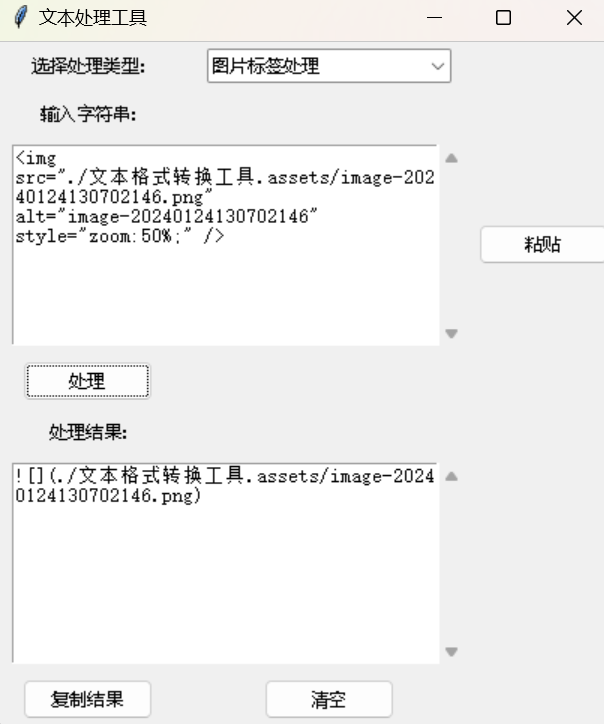

# 文本处理工具

## 功能

## 一、将论文中的角标转为typora格式的角标，实现在typora中引用跳转

分为两步：

第一步：选择**文本处理**，将要转换的文章主体粘贴进文本框（点击**粘贴**即可把剪贴板的内容粘进去），点击**处理**，生成的结果点击**复制结果**可以粘贴到剪贴板上

第二步：选择**转为脚注**，将引用的论文**粘贴**进去，生成的结果点击**复制结果**可以粘贴到剪贴板上

两种类型粘贴到markdown类型文件中，即可实现引用跳转

目前仅支持以下引用格式的转换：

下面这种用人名做引用的还无法实现转换：

## 二、typora图片链接格式转obsidian图片链接格式

typora下面两种图片的链接格式在obsidian中无法正常显示，需要修改格式

选择**图片标签处理**，将上述两种链接输入进行**处理**（第二种链接格式不行的原因是obsidian中空格要换成%20）

### 目前只能做那么多了，后续有想法再补充，用人名做引用的没思路